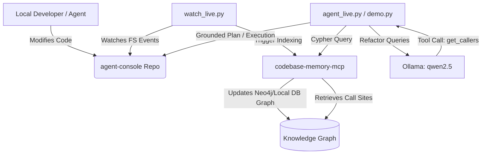

# agent-graph 🧠

A demonstration and development harness showcasing **memory-grounded codebase refactoring** and **live change impact analysis**. This project integrates local Large Language Models (via Ollama) with a codebase knowledge graph powered by `codebase-memory-mcp`.

By utilizing a structured knowledge graph representing codebase symbols, references, and call trees, we enable agentic workflows to perform precise refactoring and blast-radius analysis without resorting to blind guessing or scanning the entire project.

---

## 🛠️ System Architecture & Workflow



---

## 📋 Prerequisites & Setup

Before running the scripts in this project, ensure the following dependencies are installed and configured:

### 1. Ollama & Local Model
Install [Ollama](https://ollama.com/) and run the default model used by the scripts:
```bash
# Start Ollama (if not already running)
# Pull the target model
ollama pull qwen2.5:latest
```

### 2. codebase-memory-mcp
Ensure the CLI and MCP server `codebase-memory-mcp` is installed and available in your environment path.
The scripts expect `codebase-memory-mcp` to be accessible under `/Users/akshaysharma/.local/bin` or standard shell `PATH`.

### 3. Target Codebase (agent-console)
This project is configured to run against the companion project:
* **Project Location:** `/Users/akshaysharma/Documents/Claude/Projects/Akshay-bnb/agent-console`
* **Knowledge Graph ID:** `Users-akshaysharma-Documents-Claude-Projects-Akshay-bnb-agent-console`

*Note: If you run this in a different workspace or location, update the `REPO` and `PROJECT` constants at the top of the python scripts.*

---

## 🚀 How to Run the Demos

### 1. Compare Blind vs. Grounded Agent: `demo.py`
This script compares how a standard LLM agent fares when proposing a refactor vs. an agent grounded with exact call-graph memory.
* **Refactor Task:** Rename `highlight` to `highlightTarget` in `agent-console`'s `HighlightProvider` context and update all callers.
* **Execution:**
  ```bash
  python3 demo.py
  ```
* **What it does:**
  1. Queries the codebase memory graph for the ground-truth call sites of the `highlight` function.
  2. Runs a **Blind Agent** prompt (model only sees the definition file, not the rest of the codebase) and shows its output.
  3. Runs a **Grounded Agent** prompt (model is supplied with the exact callers fetched from the graph) and shows its output.
  4. Automatically applies the rename across the codebase using boundary-safe regex.
  5. Verifies if there are any remaining calls to the old name.

### 2. Live Change Impact / Blast Radius Watcher: `watch_live.py`
This script monitors the companion repository in real-time, updates the graph model, and logs impacted symbols.
* **Execution:**
  ```bash
  python3 watch_live.py
  ```
* **What it does:**
  1. Continuously watches the `agent-console` codebase for file modifications (matching `.ts`, `.tsx`, `.js`, `.jsx`).
  2. On file changes, it automatically re-indexes the repository incrementally via `codebase-memory-mcp`.
  3. Queries the MCP backend to detect modified/impacted symbols (the blast radius) and prints them directly to the terminal.
  4. Keeps the graph visualization up-to-date (if running the server interface on `http://localhost:9749`).

### 3. Agentic Graph Tool Call Demo: `agent_live.py`
A fully-autonomous agent demo where the LLM decides on its own to invoke the codebase-memory tool rather than having facts pre-provided.
* **Execution:**
  ```bash
  python3 agent_live.py
  ```
* **What it does:**
  1. Issues a complex refactoring prompt to the Ollama model.
  2. Exposes a tool function `get_callers(function_name)` map-backed by `codebase-memory-mcp`'s query capability.
  3. The model autonomously invokes the tool to discover dependencies, receives the structured JSON output, and uses that information to produce a flawless final refactoring plan.

---

## ⚙️ Customization & Configuration

You can easily adjust the target model or repository paths by editing the header variables in the Python scripts:

```python
# Configure the model to use
MODEL = "qwen2.5:latest"

# Configure the target repository location
REPO = "/Users/akshaysharma/Documents/Claude/Projects/Akshay-bnb/agent-console"
```
